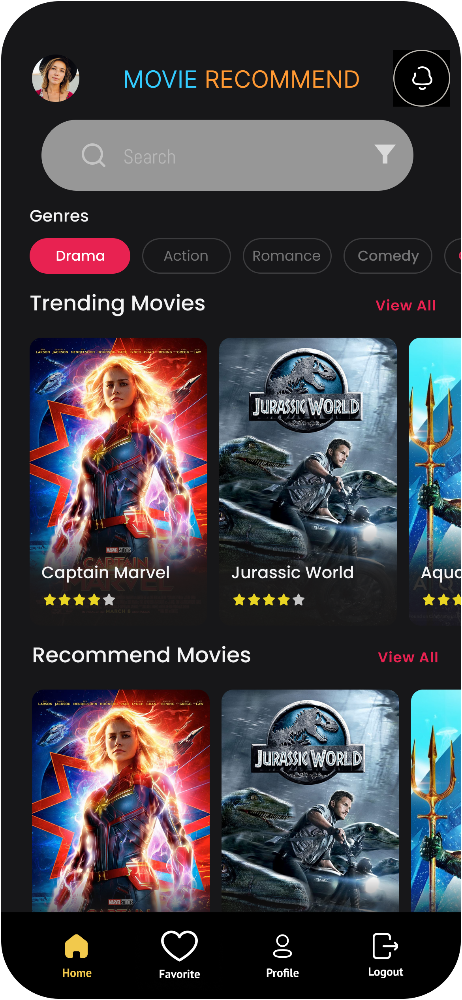
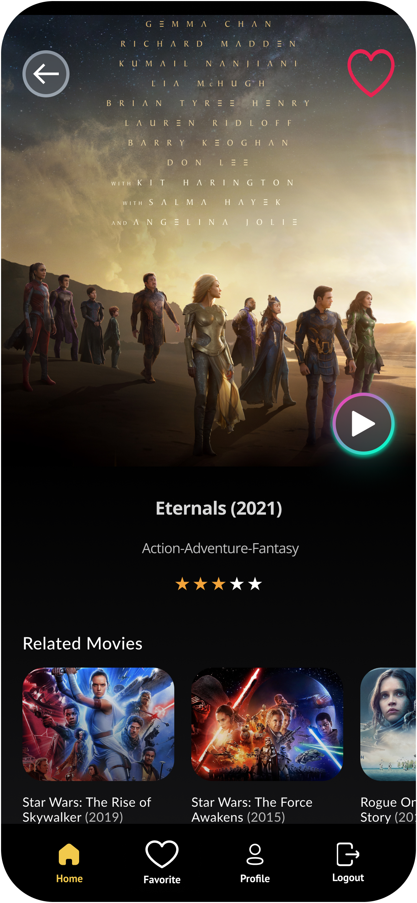
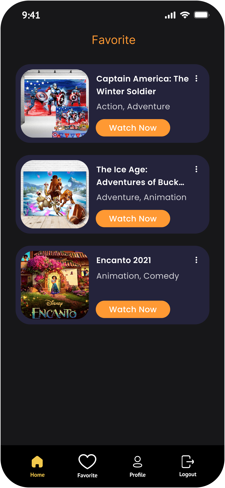
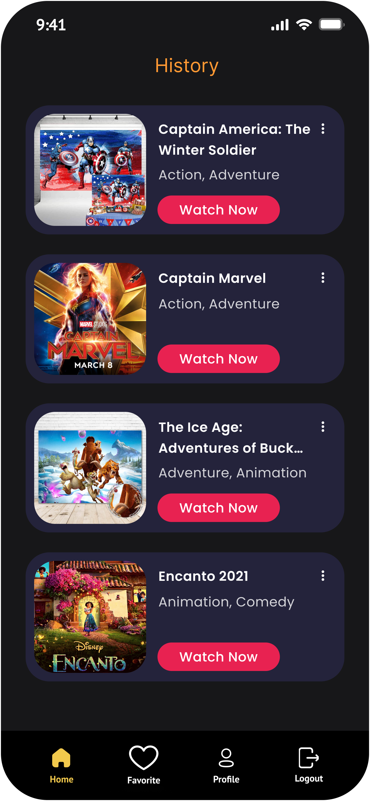

༼ つ ｡◕‿‿◕｡ ༽つ

## Movie Recommend

<a href="https://reactnative.dev/">
    
</a>
<a href="https://m2.material.io/design">
    
</a>

Movie Recommend là ứng dụng đề xuất phim cho người dùng sử dụng hai phương pháp đề xuất nổi bật là LFCF-DL và Content-Based Filtering .

<p align="center">
    
    
    
 <br />
    
    
</p>

## Keywords 🐳

- Recommender systems, movie recommend, LFCF-DL, Content-Based filtering, MovieLens 100K 🤖

## Tính năng 🦉

Chi tiết xem [tại đây](./BaoCao.pdf)

## Screenshots

- Authentication
<p align="center">
    
    
</p>

- HomeScreen
<p align="center">
    
</p>

- Detail Movie
<p align="center">
    
</p>

- List Movie: Favorite, Watched, Catalogues
<p align="center">
    
    
    
</p>

## Hướng dẫn sử dụng ⚙️

### `1. Hướng dẫn khởi chạy dự án react-native`

#### Getting Started

> **Note**: Make sure you have completed the [React Native - Environment Setup](https://reactnative.dev/docs/environment-setup) instructions till "Creating a new application" step, before proceeding.

##### Step 1: Start the Metro Server

First, you will need to start **Metro**, the JavaScript _bundler_ that ships _with_ React Native.

To start Metro, run the following command from the _root_ of your React Native project:

```bash
# using npm
npm start

# OR using Yarn
yarn start
```

##### Step 2: Start your Application

Let Metro Bundler run in its _own_ terminal. Open a _new_ terminal from the _root_ of your React Native project. Run the following command to start your _Android_ or _iOS_ app:

###### For Android

```bash
# using npm
npm run android

# OR using Yarn
yarn android
```

###### For iOS

```bash
# using npm
npm run ios

# OR using Yarn
yarn ios
```

If everything is set up _correctly_, you should see your new app running in your _Android Emulator_ or _iOS Simulator_ shortly provided you have set up your emulator/simulator correctly.

This is one way to run your app — you can also run it directly from within Android Studio and Xcode respectively.

##### Step 3: Modifying your App

Now that you have successfully run the app, let's modify it.

1. Open `App.tsx` in your text editor of choice and edit some lines.
2. For **Android**: Press the <kbd>R</kbd> key twice or select **"Reload"** from the **Developer Menu** (<kbd>Ctrl</kbd> + <kbd>M</kbd> (on Window and Linux) or <kbd>Cmd ⌘</kbd> + <kbd>M</kbd> (on macOS)) to see your changes!

   For **iOS**: Hit <kbd>Cmd ⌘</kbd> + <kbd>R</kbd> in your iOS Simulator to reload the app and see your changes!

##### Congratulations! :tada:

You've successfully run and modified your React Native App. :partying_face:

###### Now what?

- If you want to add this new React Native code to an existing application, check out the [Integration guide](https://reactnative.dev/docs/integration-with-existing-apps).
- If you're curious to learn more about React Native, check out the [Introduction to React Native](https://reactnative.dev/docs/getting-started).

#### Troubleshooting

If you can't get this to work, see the [Troubleshooting](https://reactnative.dev/docs/troubleshooting) page.

#### Learn More

To learn more about React Native, take a look at the following resources:

- [React Native Website](https://reactnative.dev) - learn more about React Native.
- [Getting Started](https://reactnative.dev/docs/environment-setup) - an **overview** of React Native and how setup your environment.
- [Learn the Basics](https://reactnative.dev/docs/getting-started) - a **guided tour** of the React Native **basics**.
- [Blog](https://reactnative.dev/blog) - read the latest official React Native **Blog** posts.
- [`@facebook/react-native`](https://github.com/facebook/react-native) - the Open Source; GitHub **repository** for React Native.

### `2. Tải dự án về máy`

- Cách Clone về với git:

  ```sh
  git clone https://github.com/Ninhnon/MovieRecommend.git
  ```

- Cài đặt các packages cần thiết:

  ```sh
  # using npm
  npm i
  ```

### `3. Khởi chạy dự án`

#### For Android

```bash
# using npx
npx react-native run-android

# using npm
npm run android

# OR using Yarn
yarn android
```

#### For iOS

```bash
# using npm
npm run ios

# OR using Yarn
yarn ios
```

## Link ứng dụng trên nền tảng Google Play ✨

https://bit.ly/MovieRecommendUIT
